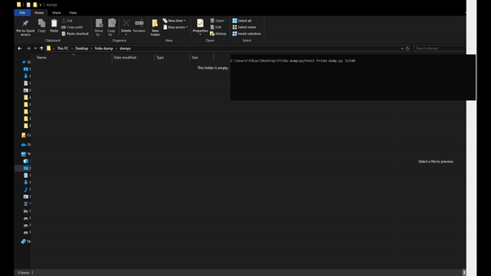

# frida-dump
This tool's purpose is to dump the memory of a running process. Although there are other tools already doing this (fridump) they repeatedly make RPC calls to the script when it could all be handled inside of it in one go. Also, this agent is written using TypeScript which offers considerable improvements when developing.



### How to compile & load

```sh
$ git clone https://github.com/azurda/frida-dump.git
$ cd frida-dump/
$ pip install frida frida-tools
$ npm install
$ npm run build
```

### Development workflow

To continuously recompile on change, keep this running in a terminal:

```sh
$ npm run watch
```

And use an editor like Visual Studio Code for code completion and instant
type-checking feedback.
